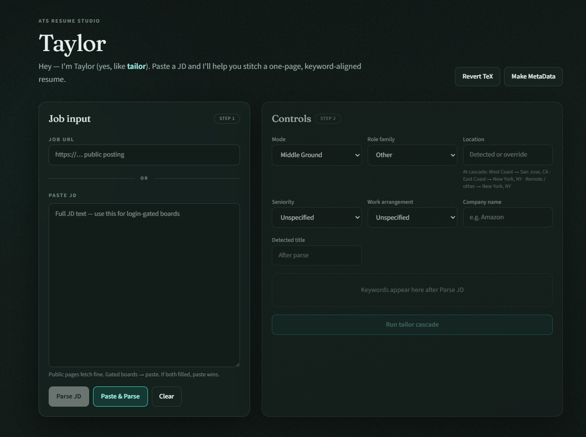
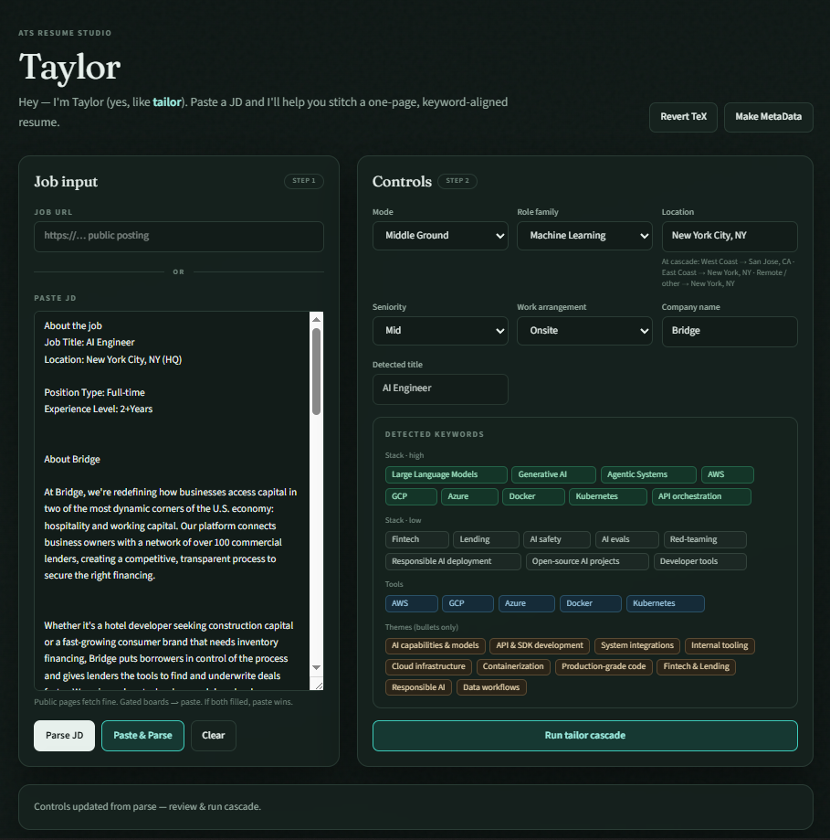

# Taylor — Resume AI

A local-first web app that tailors your **LaTeX resume to each job description** for
better ATS keyword alignment. Paste a JD (or a public job URL), pick how aggressive you
want to be, and it runs a cascade of agents — extract keywords → gap analysis → tailor →
LaTeX compile → hard one-page gate → ATS coverage score → "what changed" summary — then
hands you a compiled, single-page PDF plus the editable `.tex`.

Meet **Taylor** (yes, a pun on _tailor_), the friendly assistant that drives the UI.

> **Runs entirely on your machine.** Your resume never leaves your computer except for the
> JD text you send to the Gemini API (and even that is optional — see **Demo mode**).

---

## Demo

**Landing page** — a clean slate, ready for a job description.



**Taylor in action** — fields filled in, tailoring a resume to the pasted JD.



---

## Features

- **JD in, tailored resume out** — paste JD text or fetch a public posting by URL.
- **Four tailoring modes** — Aggressive Fabrication, Middle Ground (default), Mild Nudging, Use Original (zero AI / zero tokens).
- **Multi-master archetypes** — keep separate bases (ML / DS / SWE / custom). Cascade, PDF, and tracker all use the selected type.
- **Keyword controls** — pin must-keep terms, force-inject stack keywords (aggressive mode), and an adjustable ATS coverage target.
- **Hard one-page enforcement** — compiles the real PDF and measures the true page count; no character-count guessing.
- **Smart location handling** — remaps the header location based on the JD (e.g. West Coast → San Jose, East Coast → New York).
- **In-browser LaTeX editor** — tweak the `.tex` and recompile without leaving the app.
- **Revert to baseline** — rebuilds MetaData for all types and reloads the selected archetype’s frozen template.
- **Application tracker** — explicit **I Applied ✓** saves job metadata, “what changed” trace, and tailored `.tex` (no PDF) to a local store; browse everything on `/applications`.
- **Pace & analytics** — today / week (Mon–Sun) / month / lifetime vs goals, status funnel, 14-day sparkline, breakdowns by resume type / role / mode.
- **Export pack** — download the tailored PDF + `.tex` together.
- **Dark / light mode** and a playful, responsive UI.
- **Demo mode** — explore the whole UI with zero API key using local mocks.

---

## Prerequisites

1. **Node.js 20 or newer** — check with `node --version`.
2. **Tectonic** (the LaTeX engine used to compile PDFs). This is **required to generate
   PDFs** — the app starts and runs without it, but any compile step will fail until it's
   installed. See [Installing Tectonic](#installing-tectonic) below.
3. *(Optional)* A **Google Gemini API key** for real AI tailoring. Without one, the app
   runs in demo mode with local mocks.

---

## Quick start

```bash
git clone <your-repo-url>
cd Tailor_Resume_AI

# 1. install deps
npm install

# 2. set up env
cp .env.example .env.local      # Windows PowerShell: copy .env.example .env.local
#   then edit .env.local (see "Configuration" below)

# 3. install the LaTeX engine (see "Installing Tectonic")

# 4. run
npm run dev
```

Open [http://localhost:3000](http://localhost:3000).

Out of the box, `DEMO_MODE=true` means you can click around and run the cascade with
mocked AI immediately. To get a real compiled PDF you still need Tectonic installed.

---

## Example walkthrough:

1. **Install** Node 20+, then Tectonic ([Installing Tectonic](#installing-tectonic)).
2. **Clone →** `npm install` → copy `.env.example` to `.env.local`.
3. Set `NEXT_PUBLIC_RESUME_OWNER_NAME` to your name. Optionally add `GEMINI_API_KEY` and set `DEMO_MODE=false` for real AI (otherwise explore in demo mode).
4. **Put your resume in** — replace `data/template_ml.tex` (importantly, keep the section markers like `SKILLS_START` / `EXPERIENCE_START`). Optional: add `template_ds.tex` / `template_swe.tex` for other archetypes.
5. Run `npm run dev` → open [http://localhost:3000](http://localhost:3000).
6. Click **Make MetaData** — builds `master_resume_<type>.json` for every `template_*.tex`. Check the per-type results panel (✓ / ✗). Do this once whenever you change a template.
7. Paste a JD (or a public job URL) → **Parse** — controls prefill; **Resume type** auto-picks when a matching archetype exists (`data_science→ds`, `ml→ml`, `swe→swe`, else `ml`).
8. Pick a mode → **Run cascade** → wait for the PDF / “what changed”.
9. Happy with it? Click **I Applied ✓** → open **My Applications** (`/applications`) to see the row, expandable trace, and (once you have apps) the pace analytics strip.

**If something fails**

| Symptom | Fix |
|---|---|
| Cascade says no master for `ds` / type shows “no metadata yet” | Click **Make MetaData**, then retry. |
| “Tectonic failed” / no PDF | Install Tectonic; run `tectonic --version`. First compile needs network for packages. |
| AI looks generic / mocked | Set `GEMINI_API_KEY` and `DEMO_MODE=false`, restart `npm run dev`. |
| Wrong output filename | Set `NEXT_PUBLIC_RESUME_OWNER_NAME`, restart dev server. |

---

## Installing Tectonic

Tectonic is a self-contained LaTeX engine. The app looks for it in this order:

1. `tools/bin/tectonic.exe` (Windows) or `tools/bin/tectonic` (macOS/Linux)
2. a `tectonic` command on your system `PATH`

So you can either drop the binary in `tools/bin/` or install it globally — either works.
The **first compile downloads TeX packages once** (network required); later compiles are fast.

**Option A — download the binary into `tools/bin/`**

Grab the matching build from the
[Tectonic releases page](https://github.com/tectonic-typesetting/tectonic/releases),
unzip it, and place the executable at `tools/bin/tectonic` (or `tools/bin/tectonic.exe`
on Windows). `tools/bin/` is gitignored, so it stays local to your machine.

**Option B — install globally (on your PATH)**

```bash
# macOS (Homebrew)
brew install tectonic

# Windows (winget)
winget install TectonicTypesetting.Tectonic

# Arch Linux
sudo pacman -S tectonic

# Cargo (any platform with Rust)
cargo install tectonic
```

Verify:

```bash
tectonic --version
```

> Prefer classic LaTeX? You can install MiKTeX / TeX Live instead, but the app's compile
> path is built for Tectonic. See `tools/README.md` for notes.

---

## Configuration

All config lives in `.env.local` (copied from `.env.example`):

| Variable | Required | Purpose |
|---|---|---|
| `NEXT_PUBLIC_RESUME_OWNER_NAME` | No | Your name, used only to label output files → `Resume_{Your_Name}_{Company}.pdf`. Blank = `Resume_{Company}.pdf`. |
| `GEMINI_API_KEY` | No* | Google Gemini key for real AI tailoring. Get one at [aistudio.google.com/apikey](https://aistudio.google.com/apikey). |
| `GEMINI_MODEL_PRO` | No | Model for heavier steps (default `gemini-2.5-flash`). |
| `GEMINI_MODEL_FLASH` | No | Model for lighter steps (default `gemini-2.5-flash`). |
| `DEMO_MODE` | No | `true` (default) uses local mocks; `false` calls Gemini. |
| `TRACKER_STORE` | No | `local` (default). `redis` / `supabase` are placeholders for a future cloud swap. |
| `NEXT_PUBLIC_TRACKER_DAILY_GOAL` | No | Daily app goal for `/applications` analytics (default `5`). Set `0` to hide. |
| `NEXT_PUBLIC_TRACKER_WEEKLY_GOAL` | No | Weekly goal, Mon–Sun weeks (default `25`). |
| `NEXT_PUBLIC_TRACKER_MONTHLY_GOAL` | No | Monthly goal (default `100`). |
| `NEXT_PUBLIC_TRACKER_LIFETIME_GOAL` | No | Lifetime goal (default `0` = none). |

\* If `GEMINI_API_KEY` is empty, the app automatically stays in demo mode.

---

## Use your own resume

This repo ships with a sample `data/template_ml.tex` and `data/master_resume_ml.json`, which contains Lorem Ipsum text.
To make it yours:

1. Replace `data/template_ml.tex` with your own LaTeX resume, **keeping the section markers**
   (e.g. `SKILLS_START` / `SKILLS_END`, `EXPERIENCE_START` / `EXPERIENCE_END`) so the
   agents know which regions they may edit.
2. Set `NEXT_PUBLIC_RESUME_OWNER_NAME` in `.env.local`.
3. Click **Make MetaData** in the app (or `POST /api/metadata`) to rebuild
   `data/master_resume_ml.json` from your template. This is what the tailoring agents read.

Generated artifacts land in `runs/` (gitignored). Use **Revert TeX** to reset the working
copy back to your baselines at any time — your `data/template_*.tex` files are never modified.

### Multiple resume archetypes (multi-master)

You can keep several base resumes side by side — one LaTeX template per archetype:

- `data/template_ml.tex`  → Machine Learning
- `data/template_ds.tex`  → Data Science
- `data/template_swe.tex` → Software Engineering
- `data/template_<slug>.tex` → any custom archetype (`<slug>` = `[a-z0-9_]+`)

Adding a new type is just **drop a `template_<slug>.tex` + run Make MetaData**. Types are
discovered dynamically (no code change). **Make MetaData** parses every
`template_<slug>.tex` independently into its own `master_resume_<slug>.json` (uses more
tokens, but it's a one-time local write). Pick the active archetype with the **Resume type**
dropdown in the controls; after **Parse** it's auto-set from the detected role family
(`ml→ml`, `data_science→ds`, `swe→swe`, other→`ml`) when that template exists, else falls
back to `ml`. The cascade, one-page gate, PDF, and tracker all use the selected type.
See [MultiMaster.MD](./MultiMaster.MD) for the design.

### Application tracker

After a cascade you’re happy with, click **I Applied ✓**.
Taylor saves a local record under `data/applications/`:
company, role, mode, resume type, keywords, ATS coverage, “what changed”, and the tailored
`.tex` source. Open **My Applications** to browse the table, re-download/compile past TeX,
and check pace analytics. See [Tracker.MD](./Tracker.MD) for the schema and adapter plan.

---

## How it works

```
JD (paste or URL)
   └─> Parse ──> suggestions prefill the controls (+ resume type)
                    └─> Run cascade (selected archetype only):
                          1. Extract keywords
                          2. Gap analysis
                          3. Tailor (edits structured JSON, not raw .tex)
                          4. Render template + Tectonic compile
                          5. Hard one-page gate (measures real page count)
                          6. ATS keyword coverage score
                          7. "What changed" summary
                    └─> Compiled PDF + editable .tex in runs/
                    └─> optional: I Applied ✓ → local tracker + /applications
```

Agents edit **structured JSON**, which is deterministically rendered into a frozen LaTeX
template — keeping output stable and one-page-safe. See [GAMEPLAN.md](./GAMEPLAN.md) for
the full design.

---

## Troubleshooting

- **"Tectonic failed" / no PDF** — Tectonic isn't installed or isn't found. Run
  `tectonic --version`; if it fails, revisit [Installing Tectonic](#installing-tectonic).
  The first compile also needs internet to fetch TeX packages.
- **First compile is slow** — expected; Tectonic caches packages after the first run.
- **AI results look generic / mocked** — you're in demo mode. Set a real `GEMINI_API_KEY`
  and `DEMO_MODE=false` in `.env.local`.
- **No master / “no metadata yet” for a resume type** — click **Make MetaData** after
  adding or changing `data/template_<type>.tex`. The UI shows per-type ✓ / ✗ results.
- **Cascade crashes mid-compile on a new type** — usually a missing or wrong-shaped
  `master_resume_<type>.json`. Re-run Make MetaData with a real API key (not demo stub)
  for that archetype.
- **`npm install` or build errors** — confirm Node 20+ (`node --version`).
- **Wrong name on output files** — set `NEXT_PUBLIC_RESUME_OWNER_NAME` and restart `npm run dev`.

---

## Scripts

```bash
npm run dev     # start the dev server
npm run build   # production build
npm run start   # serve the production build
npm run lint    # eslint
```

---

## Privacy note

Everything runs locally. Your resume data stays on your machine. Only the **job
description text** is sent to Gemini when `DEMO_MODE=false`. Tracker records live under
`data/applications/` (gitignored). If you fork this repo publicly, remember to replace
the sample resume in `data/` with your own (and don't commit personal contact details you
don't want public).
